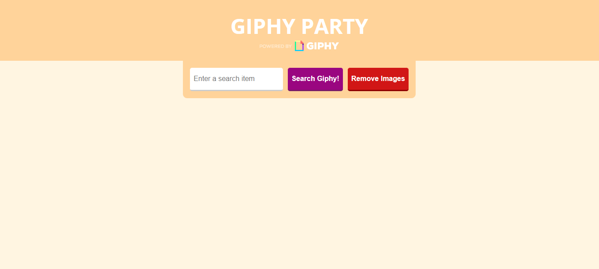

<h1>GIPHY PARTY</h1>

Giphy party é um site que criei para praticar jQuery e AJAX.  
A funcionalidade do site é pesquisar e mostrar um gif relacionado com o que usuário digitou.

Projeto inspirado em um <a href="https://www.rithmschool.com/courses/intermediate-javascript-part-2/ajax-exercises">execício da RithmSchool</a> utilizando a <a href="https://developers.giphy.com/docs/api/">API do GIPHY</a>.

